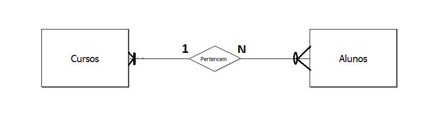

Métodos para projetos de banco de dados:

**Ascendente**("Botton-Up") Engenharia reversa.

**Descendente**("Top-down)

Segue os níveis de abstração "de cima para baixo";

___

 <h6>Top down</h6> 

___

O projeto adotado para nossas aulas é descendente (top-Down);

Modelo (conceitual) de entidade e relacionamento:

Introduzir por Pter Chen em 1976.

Entidade: representação abstrata de um "Objeto" do mundo real.

**Representação gráfica**

___

<h6>Entidade</h6>

                

___
Uma entidade tem, normalmente, um conjunto de atributos (características) que devem ser devidamente representados como no exemplo a seguir:

---

<h6>Banco Alunos</h6>

___

**Atributos** - como já mencionado, eles representam características e com informações particulares sobre um determinado tipo de ojeto.
Os atributos podem ser classificados quanto ao tipo de informações que receber. Neste aspecto podem representar como:

**Monovariado ou simples**: Um único valor para um determinado atributo de um determinado elemento de um grupo de objetos ou entidade.

**Composto**: um conjunto de subatributos com seus respectivos valores para um atributo de um determinado elemento de uma entidade.

**Multivariado**: Múltiplos valores para um determinado atributo de um determinado elemento de uma entidade.

**Determinante**: monovalorado e unívoco, ou seja, valor único para um determinado elemento que permiite indentificá-lo no meio de outros elementos pertencentes à entidade.

___

**Relacionamento e Classes de Relacionamentos**

Alguns atributos, através de sesus valores, nos levam a percepção  que eles representam algo mais como por exemplo, uma nova entidade.

No exemplo anterior, foi apresentada a entidade ALUNO. Nesta entidade existe um atributo chamado CURSO. Em um primeiro momento, podem classificar este atributo como composto, já que um curso pode ter um nome, uma área, um coordenador dentre outras coisas.

Neste momento cabe uma pergunta:
Este atributo pode se transformar em algo que sub existia independente da sua relação com o elemento de uma entidade?

Se a resposta for sim, temos aí um sério candidato a ENTIDADE.

Importante ressaltar que, o fato de ter sido identificado, inicialmente, como atributo de uma entidade; demonstra que existirá uma relação íntima entre a entidade já existente à nova entidade a ser criada.

Estas relações entre as entidades são representadas da seguinte forma:

___

 <h4> Entidades </h4>

___

A partir do disposto, é possivel, agora, apresentar o conceito de classes de relacionamento que se traduz, de fato, a relação hierárquica entre as entidades e o que é permitido a partir dela. As classes podem ser: 

    a) Um para um (1:1)
    b) Um para muitos (1:n)
    c) Muitos para muitos (n:n)

Um atalho para a correta definição das classes é especificar se, no relacionamento, as entidades se apresentam como **FORTES** e **FRACAS**.

A entidade forte é aquela que existe independentemente da outra com a qual se relaciona.
A partir disso podemos definir a cardinalidade, ou seja, além da classe, definirmos as entidade **FORTES** e **FRACAS** através da obrigatoriedade:
___
Ex: <h4>Fortes e Fracas</h4>

___

**Exemplos de Relacionamento**

___
<h5>Relacionamentos Binários

___

<h5> Agregação

___

<h5> Auto Relacionamento

