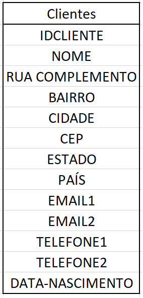

1º Parte == Caderno

**Formas Normais**

1º FN - Cood (70)
2º FN - Cood (72)
3º FN - Cood (72)

FN Boyce - Cood (Date 84)
Aperfeiçoamento da 3 FN

4º FN - Fagin 77
4º FN - Fagin 79 - Casos Particulares

Um banco normalizado deve atender, pelo menos, a 1º, 2º e 3º FN caso não haja necessidade da aplicação da 4ª e da 5ª FN.

1ª FN - Consiste na indentificação de atributos não atômicos. Uma coluna ou atributo simples ou atômico é aquela que cada célula (elemento) pode receber apenas um valor daquele domínio.
Um atributo classificado como simples e, em suma, atômico.
Logo, um dos objetos do 1º FN é fazer com que os atributos de uma tabela sejam todos atômicos ou simples.
A aplicação da 1ª FN consiste no tratamento de atributos compostos e ou multivalorados.

---

Exemplo:

---

Campos não atômicos.

**Endereço, emails, telefones.**

Campos não atômicos e multivalorados

**emails, telefones**

Campos não atômicos compostos

**Endereços**

**Técnicas da 1ª FN para composto**

Explodir os subatributos transformando-os em atributos da entidade.

      Ex: Endereço
      Rua,núero, complemento, bairro, cidade, CEP, estado e País.

**Técnicas da 1ªFN para multivalorados:**

Ou se limita quantos valores serão tratados ou gera-se em entidade fraca para armazenar N vezes quando for necessário.

      Ex: Emails, Telefone
      email_1, email_2, email_3
      tel_1, tel_2, tel_3

ou

Normalizado na primeira fase

Ex:

**2ºFN**
Uma tabela está na 2ºFN quando além de estar na 1ª FN apresena todos os atributos com dependência funcional total de chave primária.

Ex:

Antes de se aplicar a 2º FN, deve-se aplicar a 1ª FN. Desta forma:

      Não atômicos compostos
      DADOS CLIENTE: nome, endereço, CNPJ, sócios, dt_cadastrado
      DADOS GERENTES: Nome funcionário, dt_base, sexo, endereço e dt_nascimento, CPF
      FUNCIONÁRIOS PROJETO: nome funcionario, função, CPF.

Aplicando a 1ª FN

Ainda na 1ª FN

